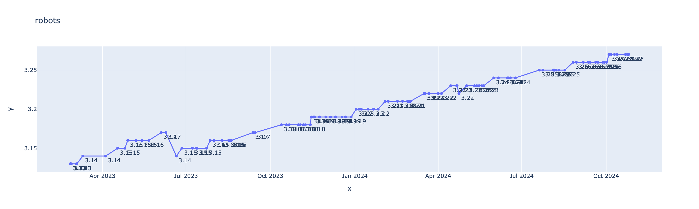
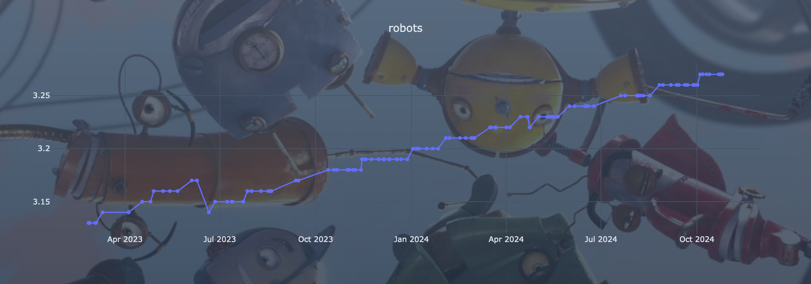

[letterstonks](https://uinelj.github.io/lbxd-stats-v2/)

During Covid I really got into movies and there's a special movie in my heart from this period and it's [Robots (2005)](https://letterboxd.com/film/robots/).
I know it's a mid y2k 3d animated movie from a now defunct studio but it really is underrated.

Anyways, like everyone at this time period I started logging movies on [letterboxd](https://letterboxd.com),
and Robots was sitting at ~2.5/5. _very mid_.

Some months ago, after ~being very insistent~ casually chatting with some friends I finally managed to organize some viewing party.
Everyone found out that the movie was a banger, and when re-logging it Robots was at 2.6!! (still _very mid_).

but this spawned an idea in my mind: how do movie ratings evolve in time?

**Spoiler**: not by a lot.

So I had to build something to track this.

## Getting the data

Letterboxd doesn't provide historical rating data, so you have to query each movie periodically.
To do this, I periodically add all popular movies to a database (it's a json file checked-in on my repo ⚰️),
and then periodically take some of them out and query their notes that I store somewhere else with a timestamp.
(this other place is - you guessed it - another json file checked-in on my repo ⚰️).

After I was done with this first step, I wanted to be sure I'd avoid doing too many daily requests. Sure, a newly released movie will see its note vary by a significant margin at first (and so we should monitor it closely).
But old, popular movies shouldn't vary too much on a daily basis, so we shouldn't query them too often.

At the same time, we don't want any movie rating to go stale: judging by the aforementioned criteria, we'd never update LOTR ratings.

Based on all of this I have a simple heuristic that takes into account:

- The age of the movie
- The time since last update
- Some measurement of the variance of the last ratings (IIRC it's a std.dev of the last 5.)

I adjusted the time since last update coefficient so that two week would make the weight go to infinity, ensuring even the most stable movies would be queried every two weeks.

## Showing the plots

v0 is a simple Python script tied to a Github action to get the newest ratings into a json file, trigger an auto commit, and have some js read the raw files and build a graph client side.

It's still online [here](https://uinelj.github.io/lbxd-stats/)

I wanted to add some pizzazz (and try [Svelte](https://svelte.dev/)+[tailwind](https://tailwindcss.com/)) so I wrote another frontend that is still ugly as f**** but is a bit more legible.
It also sports a ✨button✨ to toggle between absolute and relative ranges.

What's funny with this project is that I worked on it on and off for some months, and Robots never stopped rising 🥳.

## Next steps?

The goal here was to primarly do data collection. Analyzing trends requires an important number of data points and if you know you can't get historical data points you have to start as early as possible.

Now that I have some data, perhaps re-opening this project and trying to find more interesting trends than "old movie go up, new movie go down". I wonder if we could try to predict a movie's score based on its cast, director and genre 🤔

## Show me the code!

- Scraper + v0 frontend: https://github.com/Uinelj/lbxd-stats
- v1 frontend: https://github.com/Uinelj/lbxd-stats-v2
